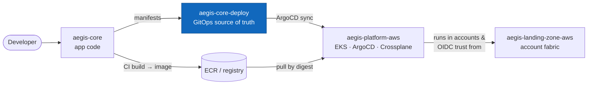
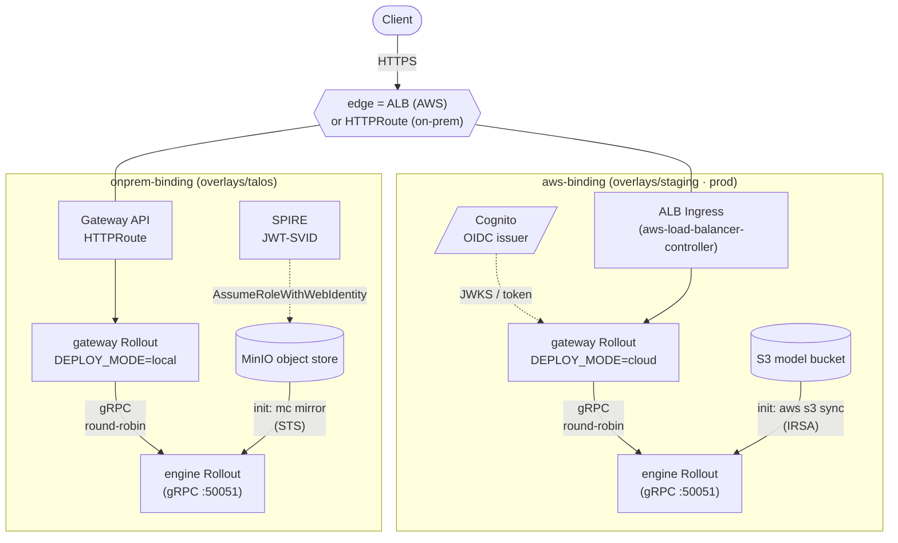
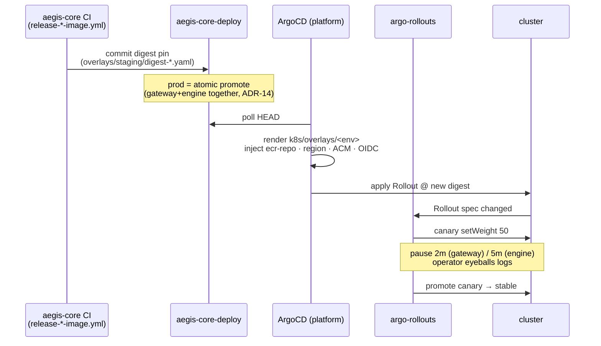

# aegis-core-deploy — GitOps source of truth for the aegis-core workload

Declarative desired state for [`aegis-core`](https://github.com/BinHsu/aegis-core).
Kustomize bases, provider-binding components, and digest-pinned image references —
ArgoCD reconciles the cluster from this repo. No application code, no CI image build:
this repo owns *what runs and where*, not *how the binary is built*.

## The Aegis portfolio (4 repos)

| Tier | Repo | Role |
|------|------|------|
| Account fabric | [`aegis-landing-zone-aws`](https://github.com/BinHsu/aegis-landing-zone-aws) | AWS Organizations, OIDC trust anchor, SCPs |
| Platform | [`aegis-platform-aws`](https://github.com/BinHsu/aegis-platform-aws) | Terraform substrate (EKS/VPC), ArgoCD, Crossplane XRDs, observability |
| Application | [`aegis-core`](https://github.com/BinHsu/aegis-core) | The service — gateway + C++ engine + web frontend |
| **Deploy (GitOps)** | [**`aegis-core-deploy`**](https://github.com/BinHsu/aegis-core-deploy) | **Kustomize + Crossplane claims; ArgoCD syncs from here** |

> **You are here: `aegis-core-deploy`.**



## What this is & who it's for

A single workload's GitOps manifests. The **base** is provider-neutral; **components**
bind it to a target (AWS or on-prem); **overlays** select the binding and pin the
per-environment image digest. The platform tier injects account-bound values
(registry URL, ACM cert ARN, Cognito endpoints, region) at sync time — none of which
are committed here.

| If you are a… | Read this | Then |
|---|---|---|
| **App developer** changing what runs | [Repository layout](#repository-layout) · [Key flow: GitOps sync](#key-flow-gitops-sync) | Bump a digest, push, let ArgoCD reconcile |
| **Platform operator** wiring the cluster | [How the platform consumes this repo](#how-the-platform-consumes-this-repo) · the [runbook](docs/runbooks/ws2r-onprem-quickstart.md) | Confirm the ApplicationSet generator + injected annotations |
| **Reviewer / forker** running it locally | [Quick start](#quick-start) | `./quickstart.sh` — full stack on a local Talos cluster, no AWS |
| **Architect** auditing decisions | [Decisions & trade-offs](#decisions--trade-offs) | Cross-repo ADRs in `aegis-platform-aws` |

## Architecture

Runtime topology once synced. The base is identical across targets; the binding
component swaps the edge (ALB vs Gateway API) and the model-store identity path
(IRSA→S3 vs SPIRE→MinIO-STS).



The engine never holds static credentials in either target: on AWS the EKS
pod-identity webhook does `AssumeRoleWithWebIdentity` via IRSA; on-prem SPIRE issues a
JWT-SVID that MinIO STS exchanges for scoped temp credentials. Same contract, two
trust roots.

## Key flow: GitOps sync

ArgoCD owns reconciliation; this repo owns the digest. A release in `aegis-core`
bumps a digest pin here; ArgoCD picks it up on the next poll and drives an
argo-rollouts canary.



The image reference is assembled at sync time: the digest is committed here
(`aegis-core@sha256:…`); the platform splices the account-specific ECR registry in
front using the `@` delimiter, preserving the digest. `kustomize.images newName` is
deliberately not used — on kustomize v5.8.1 it overwrites the digest field and renders
`:latest` (ADR-12).

## Quick start

Run the full stack on a local Talos cluster — MinIO + SPIRE substitute for S3 + IRSA.
No AWS account, no platform tier, no static credentials in the engine path.

```sh
./quickstart.sh                                      # default: ghcr.io/binhsu/aegis-core
REGISTRY=ghcr.io/<you>/aegis-core ./quickstart.sh    # your own image mirror
```

See **[docs/runbooks/ws2r-onprem-quickstart.md](docs/runbooks/ws2r-onprem-quickstart.md)**
for the end-to-end walkthrough (Talos-on-Docker default, kind/k3d adaptation), the one
image prerequisite, and troubleshooting.

### Local validation

Render any overlay before pushing — this is exactly what CI (`validate.yml`) and ArgoCD
do:

```sh
kustomize build k8s/overlays/staging      # EKS staging (base + aws-binding)
kustomize build k8s/overlays/talos        # on-prem (base + onprem-binding)
```

CI pins kustomize v5.8.1 (sha256-verified) and enforces four guards: every image is
digest-pinned, the platform registry splices in front of the digest, the seed Job
carries the same digest as the engine Rollout (ADR-14), and a prod-promotion PR moves
the gateway and engine digests together or not at all.

## Repository layout

```
k8s/
  base/
    aegis-core-gateway/     Rollout · Service · ServiceAccount · NetworkPolicy
    aegis-core-engine/      Rollout · Service (headless) · ServiceAccount · NetworkPolicy · seed Job
    aegis-core-policies/    Kyverno Policy (audio-namespace isolation)
    kustomization.yaml      aggregates the three base dirs; provider-neutral, no AWS coupling
  components/
    aws-binding/            additive layer that makes the base an EKS target (see below)
    onprem-binding/         additive layer for on-prem targets: MinIO (object store) + SPIRE (identity)
  overlays/
    staging/                EKS staging — base + aws-binding; 1 replica each; ArgoCD reconciles here
    prod/                   EKS prod   — base + aws-binding; prod hostname; digest-promoted from staging
    talos/                  on-prem    — base + onprem-binding; Gateway API HTTPRoute instead of ALB
    talos-standalone/       on-prem (no ArgoCD) — talos overlay + kustomize images: for direct kubectl apply
argocd/
  application.yaml          canonical ArgoCD intent; RENDERED by the platform ApplicationSet, not applied directly
```

### The base

Provider-neutral. No ALB Ingress, no cloud identity markers, no prometheus-operator
CRDs. The engine `ServiceAccount` carries no IRSA annotation in the base — that
marker lives in `aws-binding` and only reaches EKS targets. Both workloads are
argo-rollouts `Rollout` CRDs running a time-based 50/50 canary (gateway 2m, engine 5m).

### The aws-binding component

`components/aws-binding` is the additive layer that makes the neutral base an EKS
target (ADR-16). Included by `overlays/staging` and `overlays/prod`; the Talos
overlays omit it entirely.

What it adds:

| Resource | Purpose |
|---|---|
| `gateway-ingress.yaml` | ALB Ingress (aws-load-balancer-controller); HTTPS 443; external-dns latency routing for dual-region |
| `gateway-oidc-configmap.yaml` | Cognito issuer / audience / JWKS URL — platform-injected placeholders |
| `model-store-configmap.yaml` | S3 bucket name — platform-injected placeholder |
| `iam/aegis-core-engine-identity.yaml` | `WorkloadIdentity` XR (Crossplane) → IAM role with S3 read on the model bucket |
| SA patch | Adds `aegis.binhsu.org/irsa-role-arn: platform-injected` annotation to the engine `ServiceAccount` |
| Engine Rollout patch | Adds `model-fetch` init-container: `aws s3 sync` from the model bucket into `/models` CAS |
| Gateway Rollout patch | Sets `DEPLOY_MODE=cloud` + injects Cognito env vars from the OIDC ConfigMap |
| Seed Job patch | Same `model-fetch` init-container as the engine Rollout |

The ALB Ingress component default is the staging hostname; the prod overlay patches
it to `aegis-api.prod.aws.binhsu.org`. Each overlay's `replacements` block rewrites
the external-dns `set-identifier` and `aws-region` from the platform-injected
`aegis.binhsu.org/region` annotation — so dual-region latency routing is automatic
with no per-region manifest edits.

> **Workload identity: IRSA today, EKS Pod Identity forward.** The current code uses
> IRSA (the engine SA annotation + OIDC token projection via the EKS pod-identity
> webhook). EKS Pod Identity (no SA annotation, `PodIdentityAssociation` on the
> platform side) is the target state for WS4 — it removes the cross-namespace trust
> footgun and the Crossplane `WorkloadIdentity` XR. Until that migration lands, IRSA
> is live and verified (WS3 staging E2E 2026-06-18).

### The onprem-binding component

`components/onprem-binding` substitutes the AWS services for on-prem targets:

- **MinIO** — object store replacing S3; a `minio-bootstrap` Job seeds the model
  bucket and auto-populates the STS Role ARN.
- **SPIRE** — issues JWT-SVIDs; the engine exchanges them at MinIO STS
  (`AssumeRoleWithWebIdentity`) for scoped temp credentials — the on-prem mirror of
  IRSA. Verified end-to-end on local Talos (WS2-3, 2026-06-16).

## How the platform consumes this repo

`aegis-platform-aws` runs an ArgoCD `ApplicationSet` (SCM-provider generator). It
discovers repos carrying the `aegis-workload` GitHub topic **and** the
`argocd/application.yaml` file in this repo. For each discovered repo the
ApplicationSet renders an `Application` that:

1. points `source.path` at `k8s/overlays/prod` (or `staging` — one Application per env)
2. injects account-bound values as `kustomize.commonAnnotations` at sync time:
   - `aegis.binhsu.org/ecr-repository` — full ECR URL (no account ID committed here)
   - `aegis.binhsu.org/region` — AWS region (drives external-dns latency routing)
   - ACM cert ARN, OIDC config, S3 bucket name

The `argocd/application.yaml` in this repo is the canonical declaration of intent —
it is **not** applied directly; the ApplicationSet renders the effective Application
from it.

### Image delivery (registry + digest)

All three image-bearing resources (gateway Rollout, engine Rollout, seed Job) share
one ECR repository `aegis-core`, distinguished by digest. Two channels, separate
owners:

| Channel | Owner | Mechanism |
|---|---|---|
| **Registry URL** | Platform (injected at sync) | `aegis.binhsu.org/ecr-repository` annotation + `replacements` splices it in front of the `@sha256` digest; `@` delimiter preserves the digest |
| **Image digest** | Deploy repo (committed here) | Per-resource JSON6902 patch files (`digest-*.yaml`); staging digests set by `aegis-core` CI (`release-staging-image.yml`); prod digests promoted from staging in an atomic commit (ADR-14) |

The release workflows (`release-staging-image.yml`, `release-prod-image.yml`) live in
`aegis-core`, not here — they commit a digest pin back into this repo. This repo's own
workflows are read-only: `validate.yml` (render + four guards) and
`onprem-image-mirror.yml` (mirror images to a forker's registry for the quickstart).

Standalone `kustomize build` (no ArgoCD injection) falls back to the bare
`aegis-core@sha256:…` form — valid for local inspection; unreachable without a real
registry prefix.

## Decisions & trade-offs

This repo carries no ADRs of its own; the decisions that shape it are recorded
cross-repo in [`aegis-platform-aws/docs/ADR`](https://github.com/BinHsu/aegis-platform-aws/tree/main/docs/ADR).
The ones that directly govern these manifests:

| ADR | Decision |
|---|---|
| ADR-10 / ADR-14 | Build once, promote by digest; prod gateway+engine move together atomically |
| ADR-12 | Per-resource JSON6902 digest patches (not `kustomize.images`, which renders `:latest` on v5.8.1) |
| ADR-16 | AWS is one target bound by an additive component, never the default others retrofit around |
| ADR-09 | Engine identity via Crossplane `WorkloadIdentity` XR → IAM role |
| ADR-19 | AWS public edge: real domain + ACM + Cognito OIDC at the gateway |

## Observability

The platform cluster runs Grafana Alloy, not `prometheus-operator`. `ServiceMonitor`
resources were removed from this repo in WS3 — they caused ArgoCD sync failures on a
cluster with no `monitoring.coreos.com` CRDs. Both workloads expose Prometheus metrics
on port `8081`; Alloy scrapes them via `discovery.kubernetes` + label relabeling, and
ships to Grafana Cloud Mimir. No `ServiceMonitor` required.

## Security

- **No static credentials in the engine path** — IRSA on AWS, SPIRE→MinIO-STS on-prem.
- **No account IDs committed** — ECR registry, ACM cert ARN, and IRSA role ARN are all
  platform-injected at sync time.
- **Hardened pods** — distroless nonroot (UID 65532), `readOnlyRootFilesystem`, all
  capabilities dropped, `automountServiceAccountToken: false`, seccomp `RuntimeDefault`.
- **Namespace isolation** — a Kyverno policy enforces audio-namespace isolation;
  NetworkPolicies scope pod-to-pod traffic.

## Contributing

Changes land via PR. Before pushing, run `kustomize build` on each overlay you touched
(see [Local validation](#local-validation)) — `validate.yml` runs the same guards on
the PR and a prod-promotion that bumps only one of gateway/engine will fail. Keep the
base provider-neutral: AWS-specific resources belong in `components/aws-binding`,
on-prem ones in `components/onprem-binding`.

## License & attribution

Part of the Aegis portfolio (see the [4-repo table](#the-aegis-portfolio-4-repos)).
This is a personal portfolio project by [BinHsu](https://github.com/BinHsu); no
open-source license is granted at this time. Open an issue before reuse.
